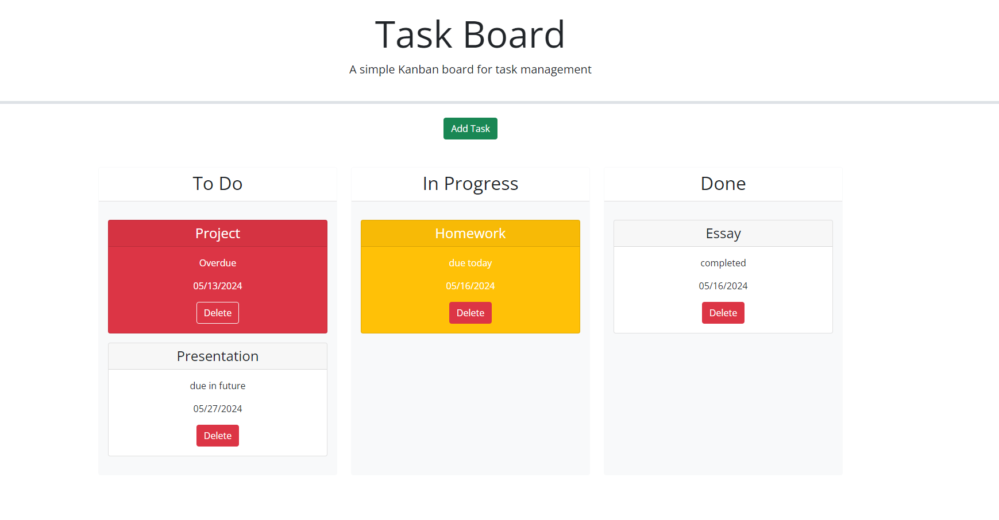

# Module-5-Challenge

## Description

This project was completed for the Columbia Coding Bootcamp. The purpose of this project was to add functionality to a page using JavaScript that allows the user to manage a to-do list and update the status of their tasks. The code allows the user to continue adding tasks until they are satisfied, and then drag the tasks into new columns with dynamic coloring based on their due date and status. The user can enter the name of the task, the due date using a datepicker, and a description of the task.

## Installation

N/A

## Usage

This project can be accessed on Git Pages at the following URL: [https://boamarant.github.io/Module-5-Challenge/](https://boamarant.github.io/Module-5-Challenge/).

## Credits

I referenced previous projects and examples from the Columbia University Coding Bootcamp to assist in creating this page. ChatGPT helped me work through bugs that I was having. 

## Features

The "Add Task" button will allow the user to input the name of their task, the due date, and a description of their task. The user can drag the tasks to different columns based on the status of their tasks, and they can delete any tasks that they wish. On a page reload, the tasks will remain there.

## Screenshot of Application

